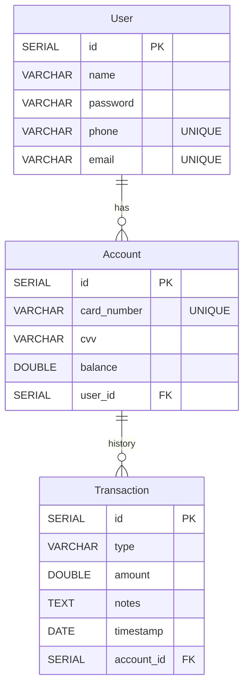

# Bank Management System
Welcome to the Bank Management System repository built using Spring Boot! This project is designed to provide a foundation for managing banking operations using modern web technologies.


## Installation

To run the Bank Management System locally, you will need the following:
- Java 11 or higher
- Maven

Once you have the required tools installed, follow these steps to install the Bank Management System:

1. Clone this repository:
2. Edit the database configurations in application.properties file.
3. Navigate to the project directory:
4. Build and run the application using Maven
    ```shell
    mvn spring-boot:run
    ```
5. Explore the Application: Once the application is up and running, open your web browser and access it at: `http://localhost:8080`


## Usage

- Customer Actions:
   - Account Creation: As a customer, you have the privilege of creating multiple accounts tailored to your financial needs.
   - View Account Details: Easily access comprehensive details about your accounts, empowering you with insights into your balances and transactions.

- Transaction Operations:
  - Deposit Funds: Any interface can conveniently utilize the `/transaction/deposit` endpoint to securely deposit funds into specified accounts.
  - Withdraw Funds: Similarly, the `/transaction/withdraw` endpoint is available for withdrawing funds from accounts, ensuring your transactions are seamless and accurate.


## Database Schema



## Technologies Used
- Java
- Spring Boot
- Spring Security
- json web token (JWT)
- Spring Data JPA
- Lombok
- MySQL
- Maven 
- Docker


